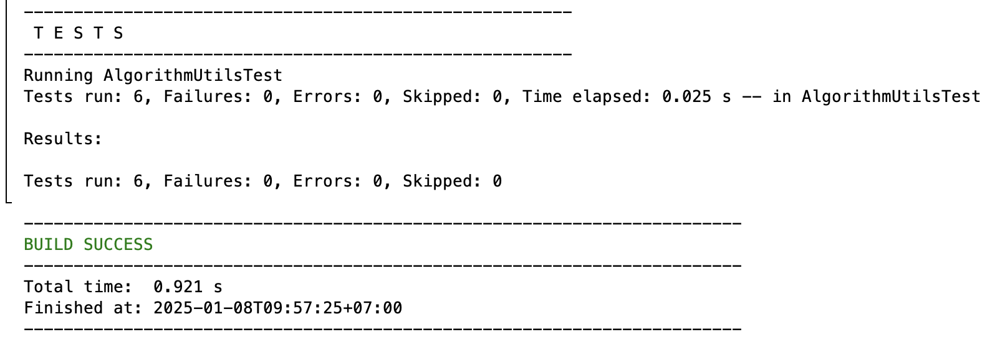
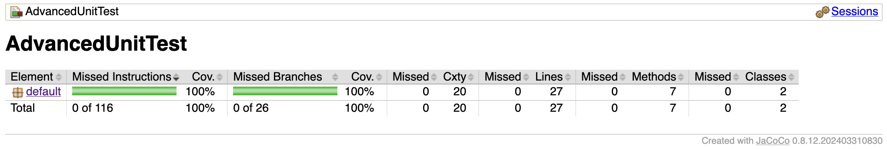

# Kiểm thử đơn vị và báo cáo độ bao phủ
 
## Mô tả dự án

**AlgorithmUtils** chứa các thuật toán phổ biến bao gồm:
1. **Tìm số nguyên tố lớn nhất trong mảng số nguyên**  
   - Hàm: `findLargestPrime(int[] arr)`
2. **Kiểm tra chuỗi đối xứng (Palindrome)**  
   - Hàm: `isPalindrome(String str)`
3. **Sắp xếp danh sách nhân viên theo tuổi**  
   - Hàm: `sortEmployeesByAge(List<Employee> employees)`

## Cấu trúc dự án
```
├── src 
│ 
├── AlgorithmUtils.java # File chính chứa các hàm tiện ích 
│ └── AlgorithmUtilsTest.java # File test sử dụng JUnit 
├── pom.xml # File cấu hình Maven (nếu sử dụng Maven) 
├── README.md # Tài liệu mô tả dự án 
└── target # Thư mục build sau khi biên dịch
```

## Chức năng

### 1. Tìm số nguyên tố lớn nhất trong mảng số nguyên
- **Hàm**: `findLargestPrime(int[] arr)`
- **Đầu vào**: Một mảng số nguyên
- **Đầu ra**: Số nguyên tố lớn nhất hoặc `null` nếu không có số nguyên tố

### 2. Kiểm tra chuỗi đối xứng
- **Hàm**: `isPalindrome(String str)`
- **Đầu vào**: Một chuỗi
- **Đầu ra**: `true` nếu chuỗi đối xứng, ngược lại trả về `false`

### 3. Sắp xếp danh sách nhân viên theo tuổi
- **Hàm**: `sortEmployeesByAge(List<Employee> employees)`
- **Đầu vào**: Một danh sách nhân viên
- **Đầu ra**: Danh sách đã sắp xếp theo tuổi tăng dần

### Class `Employee`
- Thuộc tính:
  - `name`: Tên nhân viên
  - `age`: Tuổi nhân viên

## Hướng dẫn cài đặt

### Yêu cầu
- JDK 8 trở lên
- Maven (tuỳ chọn nếu sử dụng để quản lý dependencies)

### Cách biên dịch và chạy
1. Clone dự án:  
   ```bash
   git clone https://github.com/hoangvu/AlgorithmUtils.git
   cd AlgorithmUtils

2. Biên dịch dự án
javac src/AlgorithmUtils.java

3. Chạy file test với JUnit:
mvn test

4. Tạo báo cáo độ bao phủ với Jacoco:
mvn clean test jacoco:report

## Kết quả kiểm thử

### Kiểm thử với JUnit


### Báo cáo độ phủ mã nguồn Jacoco


## Liên kết ChatGPT
[ChatGPT Link](https://chatgpt.com/share/677deb30-4b10-8001-9d59-e39305fb31df)